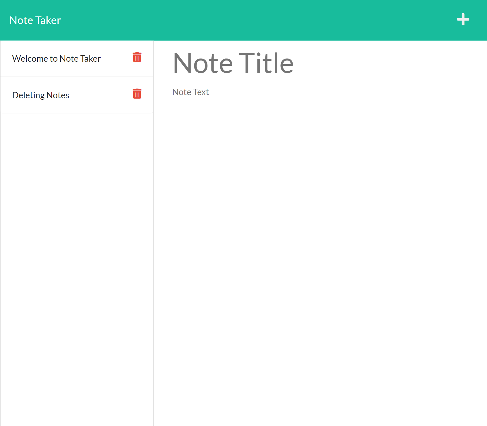
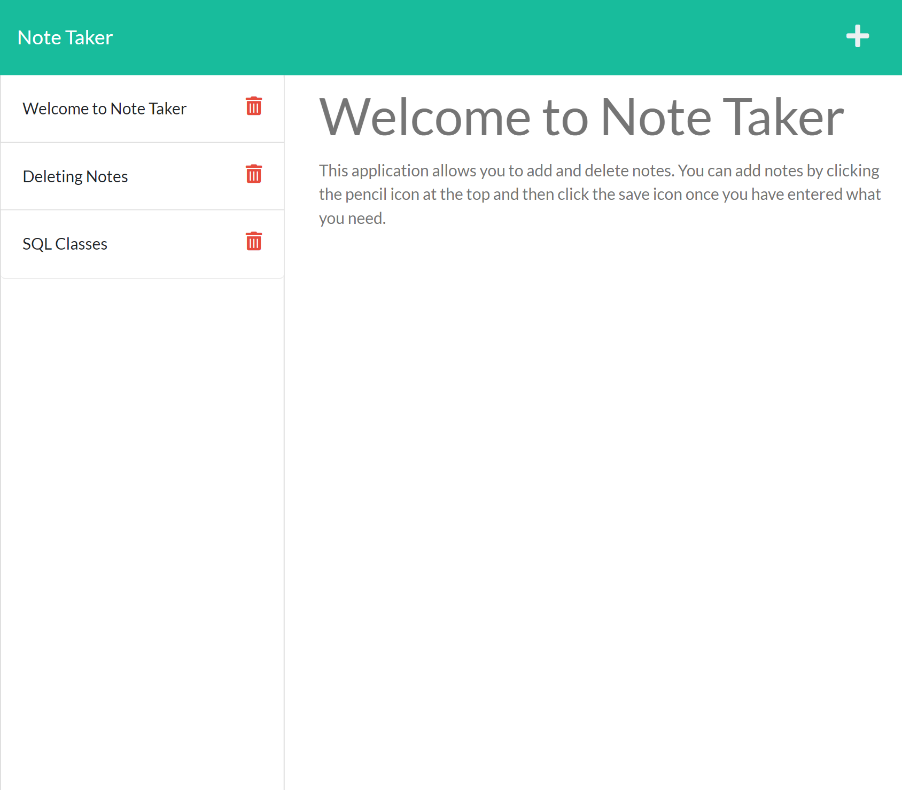

# Note taker 

## Description 
This application was created to allow users to read and write notes. This application uses Express.js to connect the client-side server and back-end server and Node.js for it's file system. This application is deployed on ku.
 
## Table of Contents
* [Description](#Description)
* [Installation](#installation)
* [Usage](#usage)
* [Screenshots](#screenshots)
* [Contributing](#contributing)
* [Tests](#tests)

## Installation 
The user should clone the repository from GitHub and download Node.js and Express.js. 

## Usage 
If the repo is cloned, call npm start on the command line. When on the application, add notes by clicking the pencil icon on the top right and save using the save icon on the top right. Users can view previous notes by clicking on them on the left side list. Users can also delete an item by clicking the trash icon for each note.  
[Screencastify]()

## Screenshots 

## Contributing 
Contributors should read the installation section.

## Tests
There are no tests for this application. 